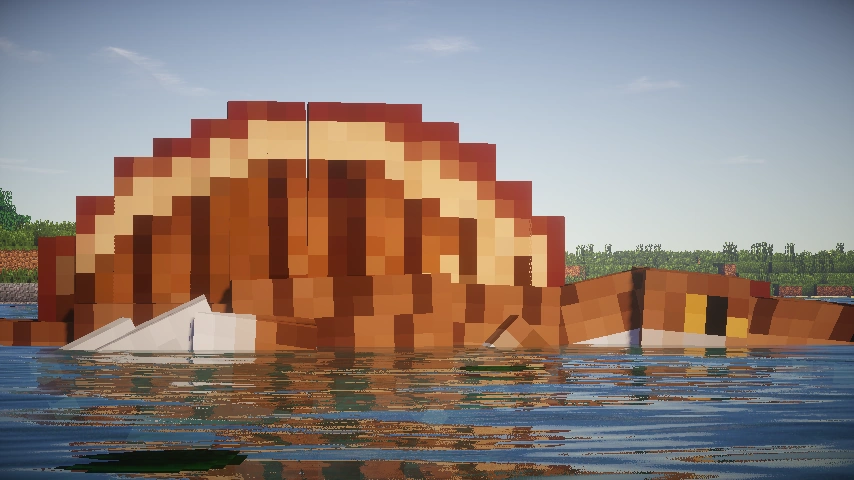
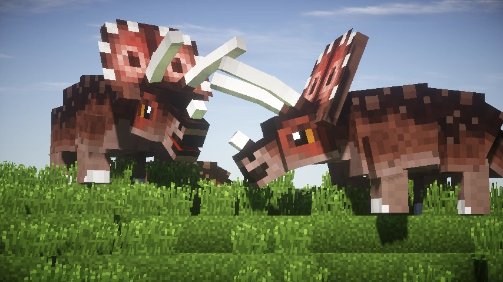
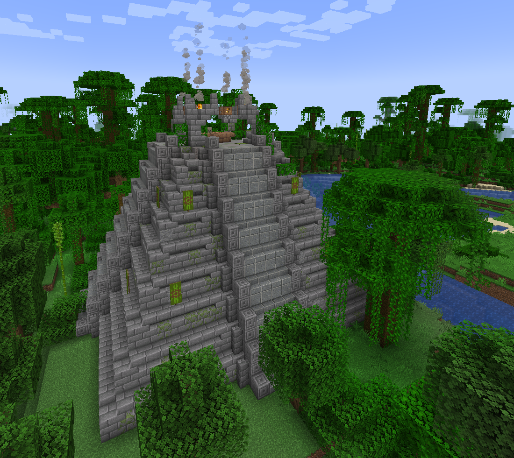
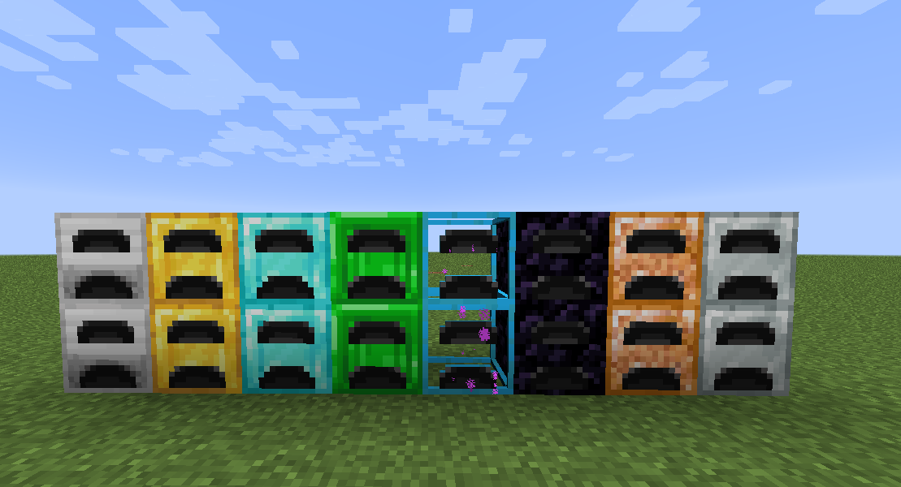
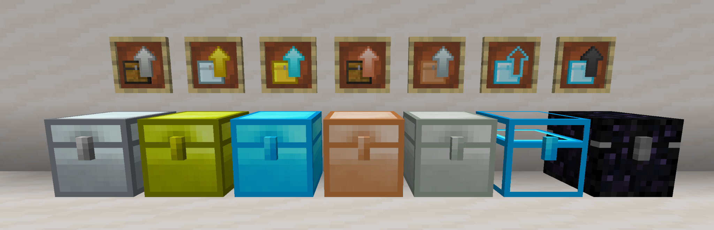
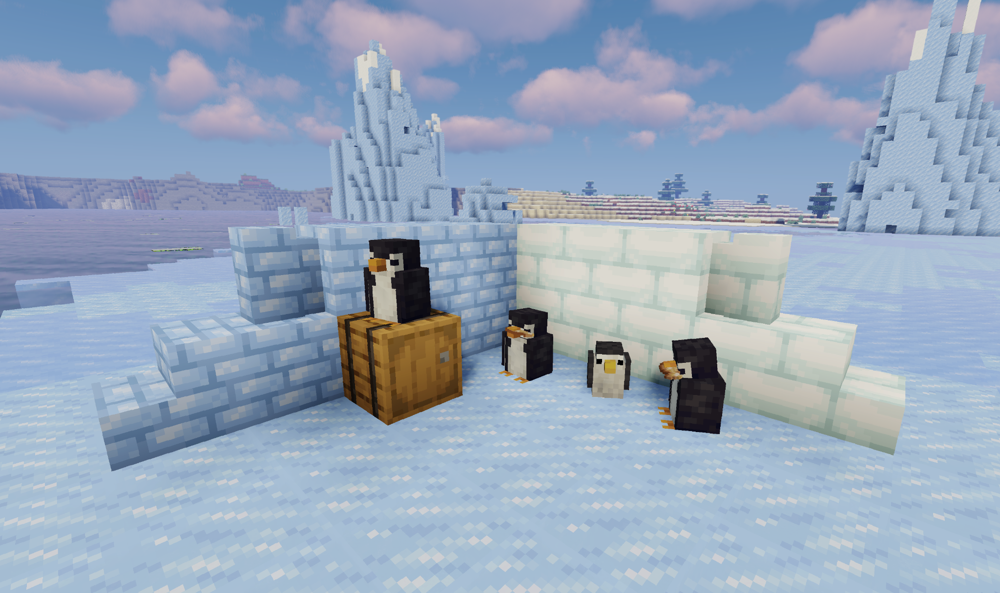

# Gurupicraft

> Modpack de Minecraft 1.21.1 baseado em **NeoForge**, com foco em dinossauros e pré-história, tecnologia, exploração, construção e conteúdo temático.

## Visão geral

- **Minecraft:** 1.21.1
- **Mod loader principal:** NeoForge
- **Quantidade de arquivos `.jar` encontrada:** 138
- **Compatibilidade adicional:** Sinytra Connector + Forgified Fabric API para alguns mods Fabric
- **Tema principal:** dinossauros, paleontologia, genética e construção de parques
- **Temas secundários:** tecnologia/automação, exploração, decoração, super-heróis e qualidade de vida

## Destaques do modpack

O Gurupicraft combina vários mods grandes de conteúdo pré-histórico. A progressão pode envolver exploração de estruturas e biomas, obtenção de fósseis, genética e recriação de espécies, construção de parques, além de uma camada tecnológica baseada em Applied Energistics 2 e Industrial Upgrade.

Também há conteúdo de Attack on Titan, Marvel e DC, além de sistemas de mapas, teleporte, armazenamento, segurança de bases e decoração.

## Pontos de atenção encontrados

### 1. Duas versões de Jurassic Saga
A pasta contém simultaneamente:
- `jurassicsaga-0.2.2-neoforge-1.21.1.jar`
- `jurassicsaga-neo-1.21.1-0.1.11.1.jar`

Esses arquivos pertencem ao mesmo mod em versões diferentes. **Não é recomendável manter ambas carregadas**, pois podem registrar os mesmos IDs de blocos, itens, entidades e recursos. A tendência é gerar erro de inicialização, comportamento indefinido ou conflitos de conteúdo.

### 2. Danny's AOT é Fabric
`dannys-aot-2.4.3.jar` é distribuído originalmente para **Fabric 1.21.1**. Neste modpack ele depende da camada de compatibilidade formada por `connector` + `forgified-fabric-api`. O próprio mod também exige GeckoLib, AAA Particles e Fabric API. Portanto, esse é um dos primeiros mods a revisar se surgirem erros de mixin, inicialização ou comportamento anormal.

### 3. JEI e EMI
Há **JEI e EMI instalados simultaneamente**. Eles cumprem funções semelhantes de consulta de itens e receitas. Essa combinação pode ser proposital, mas aumenta redundância da interface e deve ser testada em conjunto com `ae2jeiintegration`.

### 4. Jade e WTHIT
Há **Jade e WTHIT** ao mesmo tempo. Ambos mostram informações sobre o bloco/entidade apontado pelo jogador. Normalmente não é necessário manter os dois, salvo se houver algum recurso específico desejado.

### 5. Arquivos com versão aparentemente diferente
Alguns nomes merecem validação manual contra a página do projeto, por exemplo `lmft-1.1.1+1.21.9-neoforge.jar` e `NoChatRestrictions-NeoForge-MC1.21.11-v1.0.2.jar`. O nome do arquivo sugere alvo diferente de 1.21.1, embora alguns projetos usem versionamento amplo/multiversão.

### 6. Muitos mods de dinossauros sobrepostos
O pack possui vários mods que adicionam criaturas pré-históricas, fósseis, genética e estruturas. Isso é o principal diferencial do Gurupicraft, mas também aumenta a chance de:
- spawn excessivo de entidades;
- itens/fósseis com funções duplicadas;
- geração de mundo muito carregada;
- balanceamento inconsistente entre espécies;
- conflitos de IA/atributos;
- aumento de uso de memória e tempo de carregamento.

## Mods por categoria

### Dinossauros, fósseis e pré-história

| Arquivo | Função / observação |
|---|---|
| `27/09/2026     00:39        3106762 betterarcheology-neoforge-1.21.1-1.3.8.jar` | Better Archeology — amplia arqueologia, estruturas e descobertas. |
| `27/09/2026     02:06         312997 far_past-1.1.0-neoforge-1.21.1.jar` | Far Past — adiciona dinossauros que aparecem diretamente no mundo. |
| `27/09/2026     02:08         843118 flois_precambrian-1.4.2-neoforge-1.21.1.jar` | Flo's Precambrian — conteúdo inspirado no período Pré-Cambriano. |
| `27/09/2026     02:06       10906563 fossilslegacy-1.4.9.jar` | Fossils Legacy — conteúdo de fósseis, arqueologia/paleontologia e criaturas pré-históricas. |
| `27/09/2026     02:06         317415 jurassicgenesisneoforge-1.0.5-neoforge-1.21.1.jar` | Jurassic Genesis — engenharia genética e recriação de criaturas extintas. |
| `27/09/2026     02:08       16480809 jurassicrevived-1.21.1-0.102.0.jar` | Jurassic Revived — recriação de dinossauros por DNA, criação de espécies e construção de parque pré-histórico. |
| `27/09/2026     00:39       40108495 jurassicsaga-0.2.2-neoforge-1.21.1.jar` | Jurassic Saga — dinossauros, genética, máquinas e elementos inspirados em Jurassic Park. |
| `27/09/2026     02:08       30299238 jurassicsaga-neo-1.21.1-0.1.11.1.jar` | Jurassic Saga — segunda versão do MESMO mod presente simultaneamente; deve ser revisada/removida. |
| `27/09/2026     02:08      353944105 minejurassic_hammond_legacy-1.0.1-neoforge-1.21.1.jar` | MineJurassic: Hammond Legacy — grande pacote temático de Jurassic Park/dinossauros. |
| `27/09/2026     02:08        1706192 pelagic_prehistory-21.1.3.2.jar` | Pelagic Prehistory — fósseis e fauna pré-histórica com foco especial em ambientes oceânicos. |
| `27/09/2026     02:06         605872 prehistoric_paintings-NeoForge-1.21.1-1.1.0.jar` | Mod presente no conjunto atual do Gurupicraft. |

### Aventura, heróis e conteúdo temático

| Arquivo | Função / observação |
|---|---|
| `26/09/2026     23:32       45323187 dannys-aot-2.4.3.jar` | Danny's AOT — conteúdo de Attack on Titan, incluindo titãs, transformação e mecânicas ODM. É um mod Fabric carregado através do Connector. |
| `27/09/2026     02:09        4283288 marvel-2.1.0-pre6-1.21.1-neoforge.jar` | Marvel — conteúdo inspirado no universo Marvel. |
| `27/09/2026     00:39        1192693 travelers-0.8.2.2-neoforge-1.21.1.jar` | Mod presente no conjunto atual do Gurupicraft. |
| `27/09/2026     02:10        1859845 [1.21.1]-Wildfyre_Mods-DC_Mod-14.252.jar` | Wildfyre's DC Mod — conteúdo inspirado no universo DC. |

### Tecnologia, energia e automação

| Arquivo | Função / observação |
|---|---|
| `20/09/2026     20:56          66034 AE2-Things-1.4.2-beta.jar` | Mod presente no conjunto atual do Gurupicraft. |
| `20/09/2026     20:56         437906 ae2ct-1.21.1-1.1.1.jar` | Mod presente no conjunto atual do Gurupicraft. |
| `20/09/2026     20:56         189821 ae2importexportcard-1.21.1-1.4.1.jar` | Mod presente no conjunto atual do Gurupicraft. |
| `20/09/2026     20:56         101280 ae2jeiintegration-1.2.0.jar` | Mod presente no conjunto atual do Gurupicraft. |
| `20/09/2026     20:56         800392 AE2NetworkAnalyzer-1.21-2.1.3-neoforge.jar` | Mod presente no conjunto atual do Gurupicraft. |
| `20/09/2026     20:56         240969 ae2wtlib-19.3.0.jar` | Mod presente no conjunto atual do Gurupicraft. |
| `20/09/2026     20:56        8230896 appliedenergistics2-19.2.17.jar` | Applied Energistics 2 — rede de armazenamento digital, autocrafting e automação. |
| `20/09/2026     20:56       28876005 IndustrialUpgrade-1.21.1-3.3.2.27.jar` | Industrial Upgrade — mod tecnológico inspirado no legado do IndustrialCraft, com máquinas, energia e progressão industrial. |
| `20/09/2026     20:56        1120948 megacells-4.10.1.jar` | Mod presente no conjunto atual do Gurupicraft. |
| `20/09/2026     20:56         446672 pipez-neoforge-1.21.1-1.2.19.jar` | Mod presente no conjunto atual do Gurupicraft. |
| `20/09/2026     20:56         112444 Power Utilities-1.3.jar` | Mod presente no conjunto atual do Gurupicraft. |
| `20/09/2026     20:56         200437 Quantum Generators-1.4.jar` | Mod presente no conjunto atual do Gurupicraft. |
| `20/09/2026     20:56          33538 reactorplus-1.21.1-1.1.jar` | Mod presente no conjunto atual do Gurupicraft. |
| `20/09/2026     20:56         134648 Simply Quarries-1.3.jar` | Mod presente no conjunto atual do Gurupicraft. |
| `20/09/2026     20:56          57064 Watering Can-1.0.jar` | Mod presente no conjunto atual do Gurupicraft. |

### Armazenamento e logística

| Arquivo | Função / observação |
|---|---|
| `20/09/2026     20:56         264089 EnderStorage-1.21.1-2.13.0.191.jar` | Mod presente no conjunto atual do Gurupicraft. |
| `20/09/2026     20:56         305975 ironchest-1.21-neoforge-16.0.7.jar` | Mod presente no conjunto atual do Gurupicraft. |
| `20/09/2026     20:56         986725 sophisticatedbackpacks-1.21.1-3.25.19.1465.jar` | Mod presente no conjunto atual do Gurupicraft. |
| `20/09/2026     20:56        1494299 sophisticatedcore-1.21.1-1.3.95.1311.jar` | Mod presente no conjunto atual do Gurupicraft. |
| `20/09/2026     20:56        1131419 StorageDrawers-neoforge-1.21.1-13.11.4.jar` | Mod presente no conjunto atual do Gurupicraft. |

### Construção, decoração e mobiliário

| Arquivo | Função / observação |
|---|---|
| `27/09/2026     13:01        2422436 another_furniture-neoforge-4.0.3.jar` | Mod presente no conjunto atual do Gurupicraft. |
| `20/09/2026     20:56       15020578 chipped-neoforge-1.21.1-4.0.2.jar` | Mod presente no conjunto atual do Gurupicraft. |
| `27/09/2026     00:39         171557 DiagonalFences-v21.1.1-1.21.1-NeoForge.jar` | Mod presente no conjunto atual do Gurupicraft. |
| `20/09/2026     20:56         191190 elevatorid-neoforge-1.21.1-1.11.4.jar` | Mod presente no conjunto atual do Gurupicraft. |
| `20/09/2026     20:56        4283953 FramedBlocks-10.5.1.jar` | Mod presente no conjunto atual do Gurupicraft. |
| `27/09/2026     00:39        6716992 paladin-furniture-mod-1.5.0-neoforge-mc1.21.1.jar` | Mod presente no conjunto atual do Gurupicraft. |
| `27/09/2026     00:39        5193371 [1.21.1] SecurityCraft v1.10.2.1.jar` | SecurityCraft — blocos e sistemas de segurança para bases. |

### Exploração, estruturas, mapas e viagem

| Arquivo | Função / observação |
|---|---|
| `20/09/2026     20:56         622794 ftb-chunks-neoforge-2101.1.13.jar` | Mod presente no conjunto atual do Gurupicraft. |
| `20/09/2026     20:56         593606 lootr-neoforge-1.21-1.10.35.96.jar` | Mod presente no conjunto atual do Gurupicraft. |
| `20/09/2026     20:56         216873 NaturesCompass-1.21.1-3.0.3-neoforge.jar` | Mod presente no conjunto atual do Gurupicraft. |
| `20/09/2026     20:56        1260796 Structory_1.21.x_v1.3.12.jar` | Mod presente no conjunto atual do Gurupicraft. |
| `20/09/2026     20:56         865610 waystones-neoforge-1.21.1-21.1.25.jar` | Waystones — pontos de teleporte e viagem rápida. |
| `20/09/2026     20:56         955196 XaerosWorldMap_1.39.12_NeoForge_1.21.jar` | Xaero's World Map — mapa global. |
| `20/09/2026     20:56        1710781 Xaeros_Minimap_25.2.10_NeoForge_1.21.jar` | Xaero's Minimap — minimapa em tempo real. |
| `27/09/2026     00:39         782160 YungsBetterDungeons-1.21.1-NeoForge-5.1.4.jar` | Mod presente no conjunto atual do Gurupicraft. |
| `27/09/2026     00:39         136820 YungsBridges-1.21.1-NeoForge-5.1.1.jar` | Mod presente no conjunto atual do Gurupicraft. |

### Comida, agricultura e sobrevivência

| Arquivo | Função / observação |
|---|---|
| `27/09/2026     01:02        2964387 FarmersDelight-1.21.1-1.2.9.jar` | Farmer's Delight — expansão de culinária, agricultura e preparação de alimentos. |
| `20/09/2026     20:56           9511 fastleafdecay-35.jar` | Mod presente no conjunto atual do Gurupicraft. |
| `20/09/2026     20:56           4436 noweed-1.21.1-1.0.jar` | Mod presente no conjunto atual do Gurupicraft. |
| `27/09/2026     00:39         287634 rightclickharvest-neoforge-4.6.1+1.21.1.jar` | Mod presente no conjunto atual do Gurupicraft. |

### Interface e qualidade de vida

| Arquivo | Função / observação |
|---|---|
| `20/09/2026     20:56          98641 BetterAdvancements-NeoForge-1.21.1-0.4.3.21.jar` | Melhoria de interface ou qualidade de vida. |
| `20/09/2026     20:56          13871 BetterPingDisplay-1.21.1-1.1.jar` | Melhoria de interface ou qualidade de vida. |
| `27/09/2026     00:39         163914 BHMenu-NeoForge-1.21-2.4.4.jar` | Melhoria de interface ou qualidade de vida. |
| `20/09/2026     20:56          61728 cherishedworlds-neoforge-10.1.1+1.21.1.jar` | Melhoria de interface ou qualidade de vida. |
| `20/09/2026     20:56          77555 Controlling-neoforge-1.21.1-19.0.5.jar` | Melhoria de interface ou qualidade de vida. |
| `27/09/2026     00:39        1111538 emi-1.1.24+1.21.1+neoforge.jar` | EMI — visualização de itens/receitas; funcionalidade parcialmente sobreposta ao JEI. |
| `20/09/2026     20:56        4297501 fancymenu_neoforge_3.8.1_MC_1.21.1.jar` | Melhoria de interface ou qualidade de vida. |
| `20/09/2026     20:56        9309183 guideme-21.1.15.jar` | Melhoria de interface ou qualidade de vida. |
| `20/09/2026     20:56         725736 Jade-1.21.1-NeoForge-15.10.3.jar` | Jade — HUD com informações sobre blocos e entidades. |
| `20/09/2026     20:56          74419 JadeAddons-1.21.1-NeoForge-6.1.0.jar` | Melhoria de interface ou qualidade de vida. |
| `20/09/2026     20:56        1517028 jei-1.21.1-neoforge-19.25.1.332.jar` | JEI — visualização de itens e receitas. |
| `20/09/2026     20:56          81808 LegendaryTooltips-1.21.1-neoforge-1.5.5.jar` | Melhoria de interface ou qualidade de vida. |
| `20/09/2026     20:56          73938 MouseTweaks-neoforge-mc1.21-2.26.1.jar` | Melhoria de interface ou qualidade de vida. |
| `20/09/2026     20:56        1928789 notenoughanimations-neoforge-1.11.1-mc1.21.1.jar` | Melhoria de interface ou qualidade de vida. |
| `20/09/2026     20:56         386675 ok_zoomer-neo-10.0.0-beta.10.jar` | Melhoria de interface ou qualidade de vida. |
| `20/09/2026     20:56        1205657 SimpleDiscordRichPresence-neoforge-87.0.1-build.49+mc1.21.jar` | Melhoria de interface ou qualidade de vida. |
| `20/09/2026     20:56        1966859 skinlayers3d-neoforge-1.10.1-mc1.21.1.jar` | Melhoria de interface ou qualidade de vida. |
| `20/09/2026     20:56         121037 tipsmod-neoforge-1.21.1-21.1.3.jar` | Melhoria de interface ou qualidade de vida. |
| `27/09/2026     00:39         863316 wthit-1.21.1-neo-12.10.2.jar` | WTHIT — HUD de identificação; sobrepõe parte da função do Jade. |

### Desempenho, renderização e correções

| Arquivo | Função / observação |
|---|---|
| `27/09/2026     00:39          28984 AI-Improvements-1.21-0.5.3.jar` | Otimização, correção ou melhoria técnica. |
| `20/09/2026     20:56          18382 Clumps-neoforge-1.21.1-19.0.0.1.jar` | Otimização, correção ou melhoria técnica. |
| `27/09/2026     00:39        3481341 CrashAssistant-neoforge-1.20.6-1.21.4-1.11.12.jar` | Otimização, correção ou melhoria técnica. |
| `20/09/2026     20:56        1048745 embeddium-1.0.15+mc1.21.1.jar` | Embeddium — otimização de renderização. |
| `20/09/2026     20:56        1563532 entityculling-neoforge-1.9.4-mc1.21.1.jar` | Entity Culling — evita renderizar entidades ocultas. |
| `27/09/2026     00:39         567827 entity_model_features-3.2.4-1.21-neoforge.jar` | Otimização, correção ou melhoria técnica. |
| `27/09/2026     00:39         752334 entity_texture_features_1.21-neoforge-7.1.jar` | Otimização, correção ou melhoria técnica. |
| `20/09/2026     20:56         118911 ferritecore-7.0.2-neoforge.jar` | FerriteCore — redução do uso de memória. |
| `20/09/2026     20:56         367790 ImmediatelyFast-NeoForge-1.6.9+1.21.1.jar` | ImmediatelyFast — otimizações de renderização/UI. |
| `27/09/2026     00:39         774220 lithium-neoforge-0.15.4+mc1.21.1.jar` | Lithium — otimizações de lógica e tick. |
| `20/09/2026     20:56          47035 modelfix-1.21-1.10.jar` | Otimização, correção ou melhoria técnica. |
| `27/09/2026     00:39         599474 modernfix-neoforge-5.27.20+mc1.21.1.jar` | ModernFix — conjunto de correções e otimizações. |
| `20/09/2026     20:56        2799219 neoculus-mc1.21.1-1.8.7.jar` | NeoCulus — suporte a shaders no ecossistema NeoForge. |
| `27/09/2026     00:39          46623 packetfixer-3.3.1-1.20.5-1.21.X-merged.jar` | Otimização, correção ou melhoria técnica. |
| `20/09/2026     20:56         570057 yeetusexperimentus-neoforge-87.0.0.jar` | Otimização, correção ou melhoria técnica. |

### Compatibilidade Fabric ↔ NeoForge

| Arquivo | Função / observação |
|---|---|
| `26/09/2026     23:49        4527056 connector-2.0.0-beta.15+1.21.1-full.jar` | Sinytra Connector — camada para executar determinados mods Fabric em NeoForge. |
| `27/09/2026     00:08        5578066 forgified-fabric-api-0.115.6+2.1.4+1.21.1.jar` | Forgified Fabric API — implementação da Fabric API para uso com Connector/NeoForge. |

### Bibliotecas e dependências técnicas

| Arquivo | Função / observação |
|---|---|
| `26/09/2026     23:58        5592510 aaa_particles-neoforge-1.21.1-2.3.0.jar` | Biblioteca/API/dependência utilizada por outros mods do pack. |
| `20/09/2026     20:56         584004 architectury-13.0.8-neoforge.jar` | Biblioteca/API/dependência utilizada por outros mods do pack. |
| `20/09/2026     20:56          92698 athena-neoforge-1.21-4.0.2.jar` | Biblioteca/API/dependência utilizada por outros mods do pack. |
| `27/09/2026     00:39         877948 azurelib-neo-1.21.1-3.1.11.jar` | Biblioteca/API/dependência utilizada por outros mods do pack. |
| `27/09/2026     00:39          54641 badpackets-neo-0.8.2.jar` | Biblioteca/API/dependência utilizada por outros mods do pack. |
| `20/09/2026     20:56         727272 balm-neoforge-1.21.1-21.0.55.jar` | Biblioteca/API/dependência utilizada por outros mods do pack. |
| `20/09/2026     20:56          20580 bcc-21.1.7+mc1.21.1.jar` | Biblioteca/API/dependência utilizada por outros mods do pack. |
| `20/09/2026     20:56         328814 bookshelf-neoforge-1.21.1-21.1.80.jar` | Biblioteca/API/dependência utilizada por outros mods do pack. |
| `27/09/2026     13:04        3033192 citadel-2.7.0-1.21.1.jar` | Biblioteca/API/dependência utilizada por outros mods do pack. |
| `20/09/2026     20:56        1163890 cloth-config-15.0.140-neoforge.jar` | Biblioteca/API/dependência utilizada por outros mods do pack. |
| `20/09/2026     20:56        1538347 CodeChickenLib-1.21.1-4.6.1.526.jar` | Biblioteca/API/dependência utilizada por outros mods do pack. |
| `27/09/2026     00:39         309763 Corgilib-NeoForge-1.21.1-5.0.0.9.jar` | Biblioteca/API/dependência utilizada por outros mods do pack. |
| `27/09/2026     02:18         410690 curios-neoforge-9.5.1+1.21.1.jar` | Biblioteca/API/dependência utilizada por outros mods do pack. |
| `20/09/2026     20:56        1409863 ftb-library-neoforge-2101.1.29.jar` | Biblioteca/API/dependência utilizada por outros mods do pack. |
| `20/09/2026     20:56         290368 ftb-teams-neoforge-2101.1.8.jar` | Biblioteca/API/dependência utilizada por outros mods do pack. |
| `20/09/2026     20:56         141182 ftb-xmod-compat-neoforge-21.1.6.jar` | Biblioteca/API/dependência utilizada por outros mods do pack. |
| `26/09/2026     23:49         622582 geckolib-neoforge-1.21.1-4.8.4.jar` | Biblioteca/API/dependência utilizada por outros mods do pack. |
| `20/09/2026     20:56          61377 Glodium-1.21-2.2-neoforge.jar` | Biblioteca/API/dependência utilizada por outros mods do pack. |
| `20/09/2026     20:56         213853 Iceberg-1.21.1-neoforge-1.3.2.jar` | Biblioteca/API/dependência utilizada por outros mods do pack. |
| `27/09/2026     00:39         188553 jamlib-neoforge-1.3.6+1.21.1.jar` | Biblioteca/API/dependência utilizada por outros mods do pack. |
| `27/09/2026     00:39        1539578 Kiwi-1.21.1-NeoForge-15.8.7.jar` | Biblioteca/API/dependência utilizada por outros mods do pack. |
| `20/09/2026     20:56         618842 konkrete_neoforge_1.9.9_MC_1.21.jar` | Biblioteca/API/dependência utilizada por outros mods do pack. |
| `20/09/2026     20:56        2240610 kubejs-neoforge-2101.7.2-build.348.jar` | Biblioteca/API/dependência utilizada por outros mods do pack. |
| `20/09/2026     20:56          78624 lmft-1.1.1+1.21.9-neoforge.jar` | Biblioteca/API/dependência utilizada por outros mods do pack. |
| `20/09/2026     20:56          36096 melody_neoforge_1.0.10_MC_1.21.jar` | Biblioteca/API/dependência utilizada por outros mods do pack. |
| `27/09/2026     00:39         102980 Paxi-1.21.1-NeoForge-5.1.3.jar` | Biblioteca/API/dependência utilizada por outros mods do pack. |
| `26/09/2026     23:49        1156673 PlayerAnimationLibNeoforge-1.1.6+mc.1.21.1.jar` | Biblioteca/API/dependência utilizada por outros mods do pack. |
| `20/09/2026     20:56        1299974 polylib-2100.1.0-build.183-neoforge.jar` | Biblioteca/API/dependência utilizada por outros mods do pack. |
| `20/09/2026     20:56          84812 prickle-neoforge-1.21.1-21.1.11.jar` | Biblioteca/API/dependência utilizada por outros mods do pack. |
| `20/09/2026     20:56          62031 Prism-1.21.1-neoforge-1.0.11.jar` | Biblioteca/API/dependência utilizada por outros mods do pack. |
| `20/09/2026     20:56        1080389 PuzzlesLib-v21.1.39-1.21.1-NeoForge.jar` | Biblioteca/API/dependência utilizada por outros mods do pack. |
| `27/09/2026     00:39         341009 resourcefulconfig-neoforge-1.21-3.0.11.jar` | Biblioteca/API/dependência utilizada por outros mods do pack. |
| `20/09/2026     20:56         484332 resourcefullib-neoforge-1.21-3.0.12.jar` | Biblioteca/API/dependência utilizada por outros mods do pack. |
| `20/09/2026     20:56         882032 rhino-2101.2.7-build.81.jar` | Biblioteca/API/dependência utilizada por outros mods do pack. |
| `20/09/2026     20:56          77326 Searchables-neoforge-1.21.1-1.0.2.jar` | Biblioteca/API/dependência utilizada por outros mods do pack. |
| `27/09/2026     02:17        3772788 wildfyre_library-neoforge-4.137.jar` | Biblioteca/API/dependência utilizada por outros mods do pack. |
| `27/09/2026     00:39         389834 YungsApi-1.21.1-NeoForge-5.1.8.jar` | Biblioteca/API/dependência utilizada por outros mods do pack. |

### Outros / utilitários específicos

| Arquivo | Função / observação |
|---|---|
| `20/09/2026     20:56          30389 aeinfinitybooster-neoforge-1.21.1-1.0.0.52.jar` | Mod presente no conjunto atual do Gurupicraft. |
| `20/09/2026     20:56          22423 diamondvein-1.21.1-1.2.jar` | Mod presente no conjunto atual do Gurupicraft. |
| `20/09/2026     20:56         143992 EasyMagic-v21.1.4-1.21.1-NeoForge.jar` | Mod presente no conjunto atual do Gurupicraft. |
| `27/09/2026     13:12        1909490 ecologics-1.21.1-2.3.7.jar` | Mod presente no conjunto atual do Gurupicraft. |
| `20/09/2026     20:56           4903 fastprimiteage-1.21.1-1.0.jar` | Mod presente no conjunto atual do Gurupicraft. |
| `20/09/2026     20:56           4299 faststeamage-1.21.1-1.0.jar` | Mod presente no conjunto atual do Gurupicraft. |
| `20/09/2026     20:56        1936882 ftbbackups2-neoforge-1.21-1.0.28.jar` | Mod presente no conjunto atual do Gurupicraft. |
| `20/09/2026     20:56         576866 ironfurnaces-neoforge-1.21.1-4.3.2.jar` | Mod presente no conjunto atual do Gurupicraft. |
| `27/09/2026     00:39          10508 NoChatRestrictions-NeoForge-MC1.21.11-v1.0.2.jar` | Mod presente no conjunto atual do Gurupicraft. |
| `27/09/2026     00:39        1424066 travelersbackpack-neoforge-1.21.1-10.1.38.jar` | Mod presente no conjunto atual do Gurupicraft. |

## Stack de desempenho

O modpack já possui uma pilha considerável de otimização:
- Embeddium
- Lithium
- FerriteCore
- ModernFix
- Entity Culling
- ImmediatelyFast
- AI Improvements
- Clumps
- ModelFix
- PacketFixer

Essa combinação é adequada para um pack grande, mas alterações de versões devem ser feitas com cuidado, pois otimizações profundas podem interagir com mods de entidades complexas.

## Ecossistema Applied Energistics 2

O pack possui uma instalação extensa de AE2, incluindo o mod principal e vários addons:
- `20/09/2026     20:56          66034 AE2-Things-1.4.2-beta.jar`
- `20/09/2026     20:56         437906 ae2ct-1.21.1-1.1.1.jar`
- `20/09/2026     20:56         189821 ae2importexportcard-1.21.1-1.4.1.jar`
- `20/09/2026     20:56         101280 ae2jeiintegration-1.2.0.jar`
- `20/09/2026     20:56         800392 AE2NetworkAnalyzer-1.21-2.1.3-neoforge.jar`
- `20/09/2026     20:56         240969 ae2wtlib-19.3.0.jar`
- `20/09/2026     20:56        8230896 appliedenergistics2-19.2.17.jar`
- `20/09/2026     20:56        1120948 megacells-4.10.1.jar`

Isso torna o armazenamento digital e a automação um dos pilares tecnológicos do pack.

## Dependências que não devem ser removidas sem verificar os dependentes

Entre as bibliotecas presentes estão Architectury, AzureLib, Balm, Bookshelf, Citadel, Cloth Config, CodeChickenLib, CorgiLib, Curios, GeckoLib, Kiwi, PuzzlesLib, Resourceful Lib/Config, Rhino, YUNG's API, Wildfyre Library e outras. Remover uma biblioteca isoladamente pode impedir o jogo de iniciar.

## Recomendações para manutenção

1. Manter uma versão fixa do Minecraft e NeoForge para o servidor e clientes.
2. Não atualizar vários mods de conteúdo simultaneamente sem um backup do mundo.
3. Testar primeiro mods de dinossauros/genética após cada atualização.
4. Manter `latest.log` e crash reports das inicializações com erro.
5. Criar backup antes de remover mods que adicionem blocos, entidades ou geração de mundo.
6. Evitar duas versões do mesmo mod na pasta `mods`.
7. Em um servidor dedicado, separar mods estritamente client-side quando o projeto indicar que eles não devem estar no servidor.

## Referências úteis

- Jurassic Saga: https://www.curseforge.com/minecraft/mc-mods/jurassic-saga
- Jurassic Revived: https://www.curseforge.com/minecraft/mc-mods/jurassic-revived
- Danny's AOT: https://www.curseforge.com/minecraft/mc-mods/dannys-aot
- Jurassic Genesis: https://www.curseforge.com/minecraft/mc-mods/jurassic-genesis
- Far Past: https://www.curseforge.com/minecraft/mc-mods/far-paat
- Pelagic Prehistory: https://www.curseforge.com/minecraft/mc-mods/pelagic-prehistory
- Industrial Upgrade: https://www.curseforge.com/minecraft/mc-mods/industrial-upgrade

## Instalação

1. **Baixe o pacote completo** com CurseForge, modpack installer e Hamachi pelo link abaixo:  
   [Baixar pacote completo do Gurupicraft](https://drive.google.com/file/d/1zz368kuoyWwN80d__IKPRadC4lb8kZ29/view?usp=sharing)

2. **Extraia o arquivo ZIP** baixado.

3. **Instale o CurseForge** e faça login na sua conta.

4. **Instale o Hamachi** e conclua a configuração.

5. **Execute o instalador do modpack**:
   `Gurupicraft.exe`

6. **Abra o Hamachi** e conecte-se à rede:

   **Rede:** `GROSSI-99`  
   **Senha:** `12345678`

## Imagens de mods presentes

  
  
  

  
  
  

  
  
  

  
  

## Inventário completo

Mostrar todos os arquivos .jar detectados

- `26/09/2026     23:58        5592510 aaa_particles-neoforge-1.21.1-2.3.0.jar`
- `20/09/2026     20:56          66034 AE2-Things-1.4.2-beta.jar`
- `20/09/2026     20:56         437906 ae2ct-1.21.1-1.1.1.jar`
- `20/09/2026     20:56         189821 ae2importexportcard-1.21.1-1.4.1.jar`
- `20/09/2026     20:56         101280 ae2jeiintegration-1.2.0.jar`
- `20/09/2026     20:56         800392 AE2NetworkAnalyzer-1.21-2.1.3-neoforge.jar`
- `20/09/2026     20:56         240969 ae2wtlib-19.3.0.jar`
- `20/09/2026     20:56          30389 aeinfinitybooster-neoforge-1.21.1-1.0.0.52.jar`
- `27/09/2026     00:39          28984 AI-Improvements-1.21-0.5.3.jar`
- `27/09/2026     13:01        2422436 another_furniture-neoforge-4.0.3.jar`
- `20/09/2026     20:56        8230896 appliedenergistics2-19.2.17.jar`
- `20/09/2026     20:56         584004 architectury-13.0.8-neoforge.jar`
- `20/09/2026     20:56          92698 athena-neoforge-1.21-4.0.2.jar`
- `27/09/2026     00:39         877948 azurelib-neo-1.21.1-3.1.11.jar`
- `27/09/2026     00:39          54641 badpackets-neo-0.8.2.jar`
- `20/09/2026     20:56         727272 balm-neoforge-1.21.1-21.0.55.jar`
- `20/09/2026     20:56          20580 bcc-21.1.7+mc1.21.1.jar`
- `20/09/2026     20:56          98641 BetterAdvancements-NeoForge-1.21.1-0.4.3.21.jar`
- `27/09/2026     00:39        3106762 betterarcheology-neoforge-1.21.1-1.3.8.jar`
- `20/09/2026     20:56          13871 BetterPingDisplay-1.21.1-1.1.jar`
- `27/09/2026     00:39         163914 BHMenu-NeoForge-1.21-2.4.4.jar`
- `20/09/2026     20:56         328814 bookshelf-neoforge-1.21.1-21.1.80.jar`
- `20/09/2026     20:56          61728 cherishedworlds-neoforge-10.1.1+1.21.1.jar`
- `20/09/2026     20:56       15020578 chipped-neoforge-1.21.1-4.0.2.jar`
- `27/09/2026     13:04        3033192 citadel-2.7.0-1.21.1.jar`
- `20/09/2026     20:56        1163890 cloth-config-15.0.140-neoforge.jar`
- `20/09/2026     20:56          18382 Clumps-neoforge-1.21.1-19.0.0.1.jar`
- `20/09/2026     20:56        1538347 CodeChickenLib-1.21.1-4.6.1.526.jar`
- `26/09/2026     23:49        4527056 connector-2.0.0-beta.15+1.21.1-full.jar`
- `20/09/2026     20:56          77555 Controlling-neoforge-1.21.1-19.0.5.jar`
- `27/09/2026     00:39         309763 Corgilib-NeoForge-1.21.1-5.0.0.9.jar`
- `27/09/2026     00:39        3481341 CrashAssistant-neoforge-1.20.6-1.21.4-1.11.12.jar`
- `27/09/2026     02:18         410690 curios-neoforge-9.5.1+1.21.1.jar`
- `26/09/2026     23:32       45323187 dannys-aot-2.4.3.jar`
- `27/09/2026     00:39         171557 DiagonalFences-v21.1.1-1.21.1-NeoForge.jar`
- `20/09/2026     20:56          22423 diamondvein-1.21.1-1.2.jar`
- `20/09/2026     20:56         143992 EasyMagic-v21.1.4-1.21.1-NeoForge.jar`
- `27/09/2026     13:12        1909490 ecologics-1.21.1-2.3.7.jar`
- `20/09/2026     20:56         191190 elevatorid-neoforge-1.21.1-1.11.4.jar`
- `20/09/2026     20:56        1048745 embeddium-1.0.15+mc1.21.1.jar`
- `27/09/2026     00:39        1111538 emi-1.1.24+1.21.1+neoforge.jar`
- `20/09/2026     20:56         264089 EnderStorage-1.21.1-2.13.0.191.jar`
- `20/09/2026     20:56        1563532 entityculling-neoforge-1.9.4-mc1.21.1.jar`
- `27/09/2026     00:39         567827 entity_model_features-3.2.4-1.21-neoforge.jar`
- `27/09/2026     00:39         752334 entity_texture_features_1.21-neoforge-7.1.jar`
- `20/09/2026     20:56        4297501 fancymenu_neoforge_3.8.1_MC_1.21.1.jar`
- `27/09/2026     01:02        2964387 FarmersDelight-1.21.1-1.2.9.jar`
- `27/09/2026     02:06         312997 far_past-1.1.0-neoforge-1.21.1.jar`
- `20/09/2026     20:56           9511 fastleafdecay-35.jar`
- `20/09/2026     20:56           4903 fastprimiteage-1.21.1-1.0.jar`
- `20/09/2026     20:56           4299 faststeamage-1.21.1-1.0.jar`
- `20/09/2026     20:56         118911 ferritecore-7.0.2-neoforge.jar`
- `27/09/2026     02:08         843118 flois_precambrian-1.4.2-neoforge-1.21.1.jar`
- `27/09/2026     00:08        5578066 forgified-fabric-api-0.115.6+2.1.4+1.21.1.jar`
- `27/09/2026     02:06       10906563 fossilslegacy-1.4.9.jar`
- `20/09/2026     20:56        4283953 FramedBlocks-10.5.1.jar`
- `20/09/2026     20:56         622794 ftb-chunks-neoforge-2101.1.13.jar`
- `20/09/2026     20:56        1409863 ftb-library-neoforge-2101.1.29.jar`
- `20/09/2026     20:56         290368 ftb-teams-neoforge-2101.1.8.jar`
- `20/09/2026     20:56         141182 ftb-xmod-compat-neoforge-21.1.6.jar`
- `20/09/2026     20:56        1936882 ftbbackups2-neoforge-1.21-1.0.28.jar`
- `26/09/2026     23:49         622582 geckolib-neoforge-1.21.1-4.8.4.jar`
- `20/09/2026     20:56          61377 Glodium-1.21-2.2-neoforge.jar`
- `20/09/2026     20:56        9309183 guideme-21.1.15.jar`
- `20/09/2026     20:56         213853 Iceberg-1.21.1-neoforge-1.3.2.jar`
- `20/09/2026     20:56         367790 ImmediatelyFast-NeoForge-1.6.9+1.21.1.jar`
- `20/09/2026     20:56       28876005 IndustrialUpgrade-1.21.1-3.3.2.27.jar`
- `20/09/2026     20:56         305975 ironchest-1.21-neoforge-16.0.7.jar`
- `20/09/2026     20:56         576866 ironfurnaces-neoforge-1.21.1-4.3.2.jar`
- `20/09/2026     20:56         725736 Jade-1.21.1-NeoForge-15.10.3.jar`
- `20/09/2026     20:56          74419 JadeAddons-1.21.1-NeoForge-6.1.0.jar`
- `27/09/2026     00:39         188553 jamlib-neoforge-1.3.6+1.21.1.jar`
- `20/09/2026     20:56        1517028 jei-1.21.1-neoforge-19.25.1.332.jar`
- `27/09/2026     02:06         317415 jurassicgenesisneoforge-1.0.5-neoforge-1.21.1.jar`
- `27/09/2026     02:08       16480809 jurassicrevived-1.21.1-0.102.0.jar`
- `27/09/2026     00:39       40108495 jurassicsaga-0.2.2-neoforge-1.21.1.jar`
- `27/09/2026     02:08       30299238 jurassicsaga-neo-1.21.1-0.1.11.1.jar`
- `27/09/2026     00:39        1539578 Kiwi-1.21.1-NeoForge-15.8.7.jar`
- `20/09/2026     20:56         618842 konkrete_neoforge_1.9.9_MC_1.21.jar`
- `20/09/2026     20:56        2240610 kubejs-neoforge-2101.7.2-build.348.jar`
- `20/09/2026     20:56          81808 LegendaryTooltips-1.21.1-neoforge-1.5.5.jar`
- `27/09/2026     00:39         774220 lithium-neoforge-0.15.4+mc1.21.1.jar`
- `20/09/2026     20:56          78624 lmft-1.1.1+1.21.9-neoforge.jar`
- `20/09/2026     20:56         593606 lootr-neoforge-1.21-1.10.35.96.jar`
- `27/09/2026     02:09        4283288 marvel-2.1.0-pre6-1.21.1-neoforge.jar`
- `20/09/2026     20:56        1120948 megacells-4.10.1.jar`
- `20/09/2026     20:56          36096 melody_neoforge_1.0.10_MC_1.21.jar`
- `27/09/2026     02:08      353944105 minejurassic_hammond_legacy-1.0.1-neoforge-1.21.1.jar`
- `20/09/2026     20:56          47035 modelfix-1.21-1.10.jar`
- `27/09/2026     00:39         599474 modernfix-neoforge-5.27.20+mc1.21.1.jar`
- `20/09/2026     20:56          73938 MouseTweaks-neoforge-mc1.21-2.26.1.jar`
- `20/09/2026     20:56         216873 NaturesCompass-1.21.1-3.0.3-neoforge.jar`
- `20/09/2026     20:56        2799219 neoculus-mc1.21.1-1.8.7.jar`
- `27/09/2026     00:39          10508 NoChatRestrictions-NeoForge-MC1.21.11-v1.0.2.jar`
- `20/09/2026     20:56        1928789 notenoughanimations-neoforge-1.11.1-mc1.21.1.jar`
- `20/09/2026     20:56           4436 noweed-1.21.1-1.0.jar`
- `20/09/2026     20:56         386675 ok_zoomer-neo-10.0.0-beta.10.jar`
- `27/09/2026     00:39          46623 packetfixer-3.3.1-1.20.5-1.21.X-merged.jar`
- `27/09/2026     00:39        6716992 paladin-furniture-mod-1.5.0-neoforge-mc1.21.1.jar`
- `27/09/2026     00:39         102980 Paxi-1.21.1-NeoForge-5.1.3.jar`
- `27/09/2026     02:08        1706192 pelagic_prehistory-21.1.3.2.jar`
- `20/09/2026     20:56         446672 pipez-neoforge-1.21.1-1.2.19.jar`
- `26/09/2026     23:49        1156673 PlayerAnimationLibNeoforge-1.1.6+mc.1.21.1.jar`
- `20/09/2026     20:56        1299974 polylib-2100.1.0-build.183-neoforge.jar`
- `20/09/2026     20:56         112444 Power Utilities-1.3.jar`
- `27/09/2026     02:06         605872 prehistoric_paintings-NeoForge-1.21.1-1.1.0.jar`
- `20/09/2026     20:56          84812 prickle-neoforge-1.21.1-21.1.11.jar`
- `20/09/2026     20:56          62031 Prism-1.21.1-neoforge-1.0.11.jar`
- `20/09/2026     20:56        1080389 PuzzlesLib-v21.1.39-1.21.1-NeoForge.jar`
- `20/09/2026     20:56         200437 Quantum Generators-1.4.jar`
- `20/09/2026     20:56          33538 reactorplus-1.21.1-1.1.jar`
- `27/09/2026     00:39         341009 resourcefulconfig-neoforge-1.21-3.0.11.jar`
- `20/09/2026     20:56         484332 resourcefullib-neoforge-1.21-3.0.12.jar`
- `20/09/2026     20:56         882032 rhino-2101.2.7-build.81.jar`
- `27/09/2026     00:39         287634 rightclickharvest-neoforge-4.6.1+1.21.1.jar`
- `20/09/2026     20:56          77326 Searchables-neoforge-1.21.1-1.0.2.jar`
- `20/09/2026     20:56        1205657 SimpleDiscordRichPresence-neoforge-87.0.1-build.49+mc1.21.jar`
- `20/09/2026     20:56         134648 Simply Quarries-1.3.jar`
- `20/09/2026     20:56        1966859 skinlayers3d-neoforge-1.10.1-mc1.21.1.jar`
- `20/09/2026     20:56         986725 sophisticatedbackpacks-1.21.1-3.25.19.1465.jar`
- `20/09/2026     20:56        1494299 sophisticatedcore-1.21.1-1.3.95.1311.jar`
- `20/09/2026     20:56        1131419 StorageDrawers-neoforge-1.21.1-13.11.4.jar`
- `20/09/2026     20:56        1260796 Structory_1.21.x_v1.3.12.jar`
- `20/09/2026     20:56         121037 tipsmod-neoforge-1.21.1-21.1.3.jar`
- `27/09/2026     00:39        1192693 travelers-0.8.2.2-neoforge-1.21.1.jar`
- `27/09/2026     00:39        1424066 travelersbackpack-neoforge-1.21.1-10.1.38.jar`
- `20/09/2026     20:56          57064 Watering Can-1.0.jar`
- `20/09/2026     20:56         865610 waystones-neoforge-1.21.1-21.1.25.jar`
- `27/09/2026     02:17        3772788 wildfyre_library-neoforge-4.137.jar`
- `27/09/2026     00:39         863316 wthit-1.21.1-neo-12.10.2.jar`
- `20/09/2026     20:56         955196 XaerosWorldMap_1.39.12_NeoForge_1.21.jar`
- `20/09/2026     20:56        1710781 Xaeros_Minimap_25.2.10_NeoForge_1.21.jar`
- `20/09/2026     20:56         570057 yeetusexperimentus-neoforge-87.0.0.jar`
- `27/09/2026     00:39         389834 YungsApi-1.21.1-NeoForge-5.1.8.jar`
- `27/09/2026     00:39         782160 YungsBetterDungeons-1.21.1-NeoForge-5.1.4.jar`
- `27/09/2026     00:39         136820 YungsBridges-1.21.1-NeoForge-5.1.1.jar`
- `27/09/2026     00:39        5193371 [1.21.1] SecurityCraft v1.10.2.1.jar`
- `27/09/2026     02:10        1859845 [1.21.1]-Wildfyre_Mods-DC_Mod-14.252.jar`

---
Este README foi gerado a partir da listagem atual da pasta `Gurupicraft/mods`. Sempre que mods forem adicionados, removidos ou atualizados, esta documentação deve ser revisada.